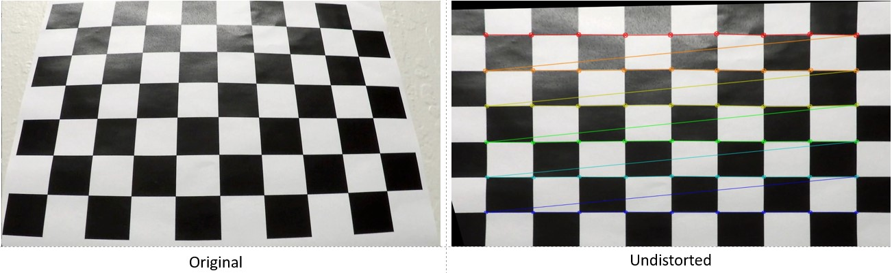
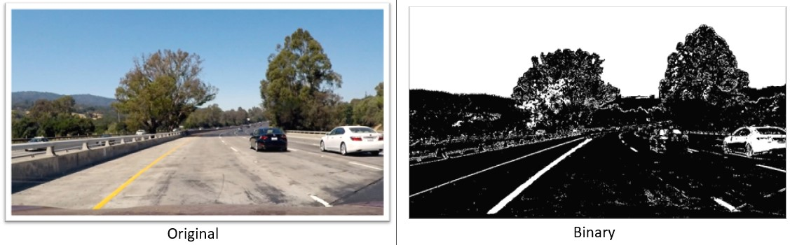
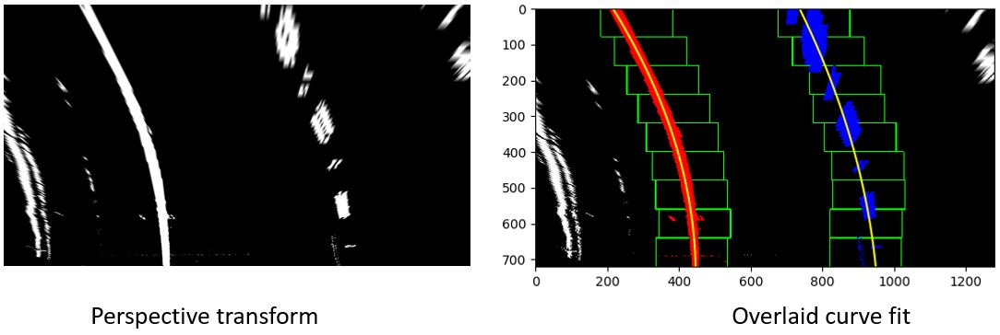
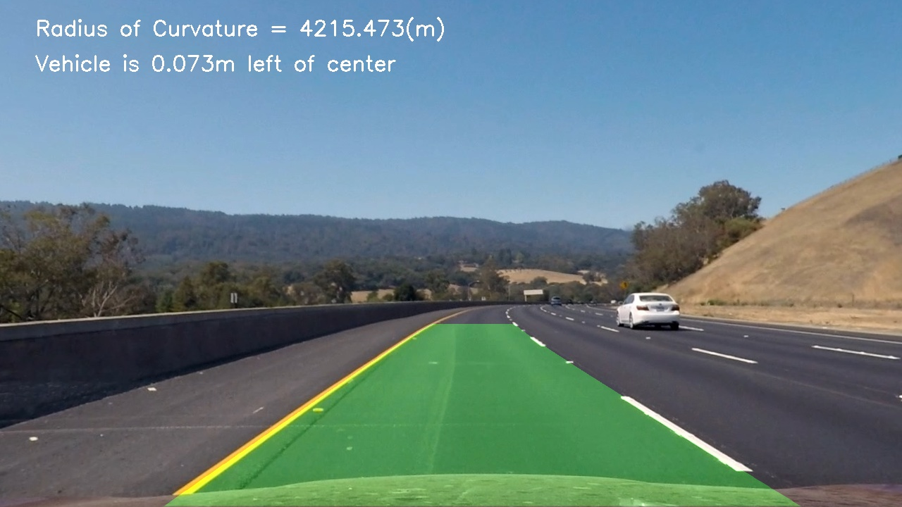

## Advanced Lane Finding

The following are the goals of this project:

* Compute the camera calibration matrix and distortion coefficients given a set of chessboard images.
* Apply a distortion correction to raw images.
* Use color transforms, gradients, etc., to create a thresholded binary image.
* Apply a perspective transform to rectify binary image ("birds-eye view").
* Detect lane pixels and fit to find the lane boundary.
* Determine the curvature of the lane and vehicle position with respect to center.
* Warp the detected lane boundaries back onto the original image.
* Output visual display of the lane boundaries and numerical estimation of lane curvature and vehicle position.

### Camera Calibration *(cam_cal.py line 56-101)*
The initial part of the script uses OpenCV functions to calculate the camera matrix and distortion coefficients. For this step the chessboard images were used to obtain image points and object points.
Firs the "object points" were prepared, which were the (x, y, z) coordinates of
the chessboard. The assumption here is that the chessboard is fixed on the (x,
y) plane at z=0, such that the object points are the same for each calibration
image. Thus, objp is just a replicated array of coordinates, and objpoints will
be appended with a copy of it ever time the chessboard corners were
successfully found in a test image.  imgpoints will be appended with the (x, y)
pixel position of each of the corners in the image plane with each successful
chessboard detection. This was followed by the OpenCV functions undistort and
`calibrateCamera()`. Next, the calculated camera matrix and distortion coefficients were used to undistort an image from the chessboard images provided in the camera_cal folder.  The chessboard corners were also drawn on the undistorted image.  The example used and the result of the script have been saved [here:](https://github.com/Eldurkar/CarND_Advanced-Lane-Lines_P2/tree/master/output_images/CameraCalibration)



### Pipeline (single images)
#### 1. Distortion correction *(video_gen.py line 104)*
Here is the test image before applying distortion correction:


Distortion correction that was calculated via camera calibration has been applied to each image.  The images in the test images folder were used to check for the distortion corrected image.  The OpenCV function undistort was used along with the camera matrix and distortion coefficients to create the undistorted images.  
Here is the test image after applying distortion correction.


#### 2. Binary image *(video_gen.py line 106-111)*
A combination of methods (i.e., color transforms, gradients) have been used to create a binary image containing likely lane pixels.  First a numpy array called preprocessImage, the same size of the image was created. The test image was read in and a sobel threshold to generate gradients for the image in x and y was applied.  Next a color threshold was applied, that used both saturation and value using the hls and hlv from OpenCV. A combination of logical operators was used so that the processed image includes the X and Y sobels in addition to the color threshold. Below is a comparison of the original and binary image.



#### 3. Perspective transform *(video_gen.py line 113-130)*
The code for my perspective transform includes a function called
`process_image()`, which appears in lines 113 through 130 in the file
`video_gen.py`. Initially the source and destination points were hard coded as
shown in the write up template, but when these points were tested, the lane
lines did not appear parallel in some of the images.  The next approach was to
define the trapezium formed by the lane lines in terms of the height and width
of the image as described in the project support video.  The trapezoid
parameters were then used to set the coordinates for the source and destination
points as shown:

```python
     src = np.float32([[img.shape[1]*(0.5-mid_width/2), img.shape[0]*height_pct], \
                    [img.shape[1]*(0.5+mid_width/2), img.shape[0]*height_pct], \
                    [img.shape[1]*(0.5+bot_width/2), img.shape[0]*bot_trim], \
                    [img.shape[1]*(0.5-bot_width/2), img.shape[0]*bot_trim]])
    offset = img_size[0] * 0.25
    dst = np.float32([[offset, 0], [img_size[0]-offset, 0], \
                    [img_size[0]-offset, img_size[1]], [offset,
img_size[1]]])
```

This resulted in the following source and destination points:
| Source	| Destination	|
|:--------------|:-------------:|
|558, 446	|320, 0		|
|691, 446	|960, 0		|
|1126, 673	|960, 720	|
|153, 673	|320, 720	|

OpenCV functions used: the perspective transform was performed using the
`getPerspectiveTransform()` function and the image was then warped using the
`warpPerspective()` function. The points in the table and the images below were
generated using the code in `PerspTrans.py`The perspective transform was tested by drawing
the `src` and `dst` points onto a test image and its warped counterpart to verify that the lines appear parallel in the warped image.


#### 4. Lane line pixels and polynomial fit *(video_gen.py line 137-200)* 
An object called the tracker was created to define the parameters required to
defined histogram boxes. The centers of the histogram boxes were used for the
curve fit and the points were averaged to get a smooth line.  Then there’s a
function called `find_window_centroids()` for finding and storing the lane segment positions. The left and right window centers are stored at each level.  The starting position for the left and right lanes were found using numpy sum and convolve. Th levels were looped over and the centers of each of the windows (histograms) were found. Convolution is a procedure that finds the points of maximum overlap given two inputs. The argmax function was used to get the index of the point with the maximum pixel overlap.
The best left/right centroid was found by using the previous left/right center as reference. 
The function finally returns averaged values of the line centers, this helps
prevent the markers from jumping around.  A `tracker()` object was created, and the windows centroids extracted and applied on to the warped image. After drawing the boxes, the centers of the boxes were used for the fitting. 
`yvals` is the range from 0 to the warped image’s height.  `res_yvals` are the
y values of the box centers. Then the `polyfit()` function was called to find the coefficients of the curve, which is a second-degree polynomial. In the example image the fitted curve was overlaid on the warped binary image.



##### Pixel conversion *(video_gen.py line 133 and 201-203)*
The pixel to real world space was set up using the following proportions such that, 10m is approximately 720 pix in y and 4m is approximately 384 pixels in x ( line 133 ).  These ratios vary depending on how the transform is set up.  

#### 5. Radius of curvature *(video_gen.py line 204-208)*
To measure the curvature of the lane the curve fit function and radius of
curvature equation
[here:](https://www.intmath.com/applications-differentiation/8-radius-curvature.php) were used.  The difference in the polyfit this time was to have the conversion perspective so that the curve is in terms of meters. First using the Numpy polyfit the radius of curvature curve was converted from pixels to meters.  The curvature of the left lane was measured for this calculation. The radius of curvature equation was then applied to the polynomial of the curve calculated previously.

#### 6. Example image of the result plotted back down onto the road identifying the lane area



##### Camera offset *(video_gen.py line 210-215)*
To find the camera center, the left and right lane pixels closest to the car were added and averaged over.  The average was then scaled by the pixels per meter in x. The final value was evaluated to check if it is to the left or right. The Open CV function puttext was used for the display, with the value rounded of and font set to white.

### Pipeline (video)
Here is the [link](output1_tracked.mp4) to the video result of the project video.

### Discussion
1.  Perspective transformation
While doing the perspective transformation identifying the 4 points in the test image to transform posed to be a challenge.  I found that the points had to be in a sequential order for the transform to work correctly, starting from the bottom left going clockwise to the bottom right.
The pixel to meters conversion ratio was also difficult to set.  It depended on how the points for the perspective transform were defined.  So, the two had to be done together.
2.  Lane curvature
Only the left lane was used to define the lane curvature. A more accurate way to define the curvature could be to also calculate the curvature of the right lane and average over the two for the actual curvature.
3.  Bumps/Gradient in the road
While attempting the challenge video and at some point, in the project video, it was noticeable that the lane lines go haywire at the far end in cases of sharp corners. Another parameter that seemed to influence the drawing of lanes was slopes in the road and bumps on the road. I suppose this is because the bumps / gradients in the road mess up the perspective transform function and the points used to define the perspective window do not apply any more.

### References
All the code in this project was adapted from the lessons and videos that are
part of the advanced lane finding project. 
