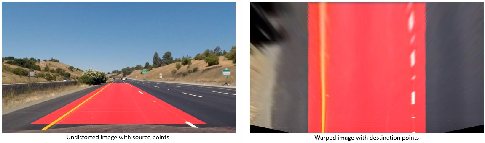

## Advanced Lane Finding

The following are the goals of this project:

* Compute the camera calibration matrix and distortion coefficients given a set of chessboard images.
* Apply a distortion correction to raw images.
* Use color transforms, gradients, etc., to create a thresholded binary image.
* Apply a perspective transform to rectify binary image ("birds-eye view").
* Detect lane pixels and fit to find the lane boundary.
* Determine the curvature of the lane and vehicle position with respect to center.
* Warp the detected lane boundaries back onto the original image.
* Output visual display of the lane boundaries and numerical estimation of lane curvature and vehicle position.

### Camera Calibration *(cam_cal.py line 56-101)*
The initial part of the script uses OpenCV functions to calculate the camera matrix and distortion coefficients. For this step the chessboard images were used to obtain image points and object points.
Firs the "object points" were prepared, which were the (x, y, z) coordinates of
the chessboard. The assumption here is that the chessboard is fixed on the (x,
y) plane at z=0, such that the object points are the same for each calibration
image. Thus, objp is just a replicated array of coordinates, and objpoints will
be appended with a copy of it ever time the chessboard corners were
successfully found in a test image.  imgpoints will be appended with the (x, y)
pixel position of each of the corners in the image plane with each successful
chessboard detection. This was followed by the OpenCV functions undistort and
`calibrateCamera()`. Next, the calculated camera matrix and distortion coefficients were used to undistort an image from the chessboard images provided in the camera_cal folder.  The chessboard corners were also drawn on the undistorted image.  The example used and the result of the script have been saved [here:](https://github.com/Eldurkar/CarND_Advanced-Lane-Lines_P2/tree/master/output_images/CameraCalibration)


### Pipeline (single images)
#### 1. Distortion correction *(video_gen_v1.py line 104)*
Here is the test image before applying distortion correction:


Distortion correction that was calculated via camera calibration has been applied to each image.  The images in the test images folder were used to check for the distortion corrected image.  The OpenCV function undistort was used along with the camera matrix and distortion coefficients to create the undistorted images.  
Here is the test image after applying distortion correction.


#### 2. Binary image *(video_gen_v1.py line 303-308)*
A combination of methods (i.e., color transforms, gradients) have been used tocreate a binary image containing likely lane pixels.  First a numpy array called `preprocessImage`, the same size of the image was created. The test image was read in and a sobel threshold to generate gradients for the image in x and y was applied.  Next a color threshold was applied, that used both saturation and value using the hls and hlv from OpenCV. A combination of logical operators was used so that the processed image includes the X and Y sobels in addition to the color threshold. Below is a comparison of the original and binary image.


#### 3. Perspective transform *(video_gen_v1.py line 312-342)*
The code for my perspective transform includes a function called
`process_image()`, which appears in lines 312 through 342 in the file
`video_gen_v1.py`. The source and destination points were hard coded
as shown in the write up template, these points were tested and the lane
lines appeared parallel. The source and destination points are as shown:
```python
    src = np.float32(
    [[(img_size[0] / 2) - 55, img_size[1] / 2 + 100],
    [((img_size[0] / 6) - 10), img_size[1]],
    [(img_size[0] * 5 / 6) + 60, img_size[1]],
    [(img_size[0] / 2 + 55), img_size[1] / 2 + 100]])
    dst = np.float32(
    [[(img_size[0] / 4), 0],
    [(img_size[0] / 4), img_size[1]],
    [(img_size[0] * 3 / 4), img_size[1]],
    [(img_size[0] * 3 / 4), 0]])
```

This resulted in the following source and destination points:
| Source	| Destination	|
|:--------------|:-------------:|
|558, 446	|320, 0		|
|691, 446	|960, 0		|
|1126, 673	|960, 720	|
|153, 673	|320, 720	|

OpenCV functions used: the perspective transform was performed using the
`getPerspectiveTransform()` function and the image was then warped using the
`warpPerspective()` function. The points in the table and the images below were
generated using the code in `PerspTrans.py`The perspective transform was tested by drawing
the `src` and `dst` points onto a test image and its warped counterpart to verify that the lines appear parallel in the warped image.



#### 4. Lane line pixels and polynomial fit *(video_gen_v1.py line 176-206)* 
A function called `find_lane_pixels()` was created to define the parameters required to
for the histogram windows.The histogram boxes were looped over to identify x and
y pixels within the windows. The function finally returns the pixel positions
for the left and right lines. 
Then the `fit_polynomial()` function was called to find the coefficients of the curve, which is a second-degree polynomial. In the example image the fitted curve was overlaid on the warped binary image.


#### 5. Radius of curvature *(video_gen_v1.py line 282-298)*
To measure the curvature of the lane the curve fit function and radius of curvature equation
[here:](https://www.intmath.com/applications-differentiation/8-radius-curvature.php)
were used.  The difference in the polyfit this time was to have the conversion
perspective so that the curve is in terms of meters. The `left_fit` and
`right_fit` arrays calculated previously were used to in the radius of
curvature equation to find the left and right curvatures.

#### 6. Example image of the result plotted back down onto the road identifying the lane area


##### Camera offset *(video_gen_v1.py line 371-377)*
To find the camera center, the left and right lane pixels closest to the car were added and averaged over.  The average was then scaled by the pixels per meter in x. The final value was evaluated to check if it is to the left or right. The Open CV function puttext was used for the display, with the value rounded of and font set to white.

### Pipeline (video)
Here is the [link](output3_tracked.mp4) to the video result of the project video.

### Discussion
1.  Perspective transformation
While doing the perspective transformation identifying the 4 points in the test image to transform posed to be a challenge.  I found that the points had to be in a sequential order for the transform to work correctly, starting from the bottom left going clockwise to the bottom right.
The pixel to meters conversion ratio was also difficult to set.  It depended on how the points for the perspective transform were defined.  So, the two had to be done together.
2.  Bumps/Gradient in the road
While attempting the challenge video and at some point, in the project video, it was noticeable that the lane lines go haywire at the far end in cases of sharp corners. Another parameter that seemed to influence the drawing of lanes was slopes in the road and bumps on the road. I suppose this is because the bumps / gradients in the road mess up the perspective transform function and the points used to define the perspective window do not apply any more.

### References
All the code in this project was adapted from the lessons and videos that are
part of the advanced lane finding project. 
